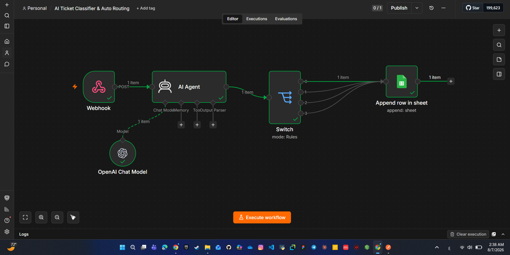

# AI Ticket Classifier & Auto Routing

## Overview

This workflow automatically classifies customer support tickets using OpenAI, then routes them through a Switch node and stores the structured results in Google Sheets.

---

## Features

- AI-powered ticket classification
- Automatic priority detection
- Department routing
- Google Sheets integration
- Built with n8n

---

## Technologies

- n8n
- OpenAI
- Google Sheets
- Webhook
- Switch Node

---

## Workflow

---

### Workflow Screenshot

---

## Output Example

| Category | Priority | Department |
|----------|----------|------------|
| Billing | High | Finance |

---

## Import

Download the JSON workflow and import it directly into n8n.
